# Learning Diary 1 - BYOD & Basics of Windows

## The purpose of this assignment is to set up your personal devices for educational purposes (HAMK BYOD), get familiar with different tools such vcommander, VDI and to understand the basics of computing.

## Materials (Available in Moodle)
1.	Getting Started & BYOD
2.	Windows Basics

## Step-by-step guide for students

Please complete the tasks as instructed and include clear screenshots when requested. If screenshot submission is not explicitly mentioned, proceed with the tasks without worrying about screenshots. Just make sure the screenshots are very clear, as unclear screenshots may lead to a score of zero.

1.	***Rename your computer***
    1.	Start PowerShell as an administrator and type the following command to rename your computer. The name of the computer should be your **firstnameLastname** that is my computer name will be **deepakkc**.
```
Rename-Computer -NewName "NewComputerName" - Restart
```
> Note: Replace "NewComputerName" with your firstnameLastname 

2.	***Basic System Information*** 
    1.	Start PowerShell and run the following command to get the basic system information. **Include a screenshot after running the command below.** 

    ```
    Get-WmiObject Win32_ComputerSystem | Select-Object Manufacturer, Model, TotalPhysicalMemory, UserName
    ```
     
    
    2.	Configure Update Settings: Check your current update settings and update if needed how updates are delivered and configure other options according to your preferences.

    3.	Recovery Options: Create a system restore point and give it a name as your firstname_lastname_rpoint. **Take the screenshot of the newly created restore point.**
    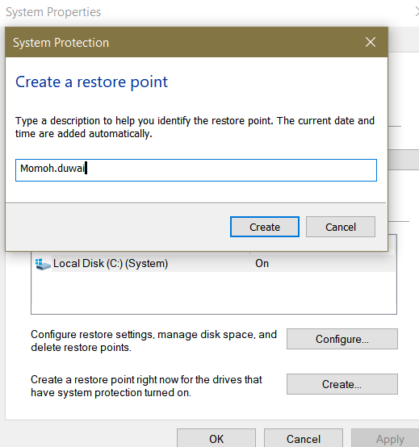  
    4.	Reset your PC: Find how you can reset your PC however you are not required to reset your PC. 
    
    5.	Advance Startup Options: Read Microsoft Documentation and make a list of Advanced Startup options that are available in Windows 11. 
    ## the advance startup list
      Safe Mode with Networking.
      Safe Mode with Command Prompt.
      Enable Boot Logging.
      Enable low-resolution video (640×480).
      Last Known Good Configuration (advanced)
      Directory Services Restore Mode
      Debugging Mode
      Disable automatic restart on system failure
      Disable Driver Signature Enforcement
     Start Windows Normally
     
3.	***Bring your Own Device***
    1.	Go through the guidelines (https://hamk-business-information-technology.github.io/os/index ) & install all required tools in your device. Include the screenshot of your desktop that verifies the installation of all tools. 
     

4.	***User Accounts & Groups***
    1.	Create a new local user account. The user account type for this user is set to "Family & other users." 
    **Take a screenshot of the newly created user account listed under "Other users."**

     

    2.	Modify the user account type that you created in the above task to “Standard User” and 
    **take a screenshot.**
     

    3.	Create a new user group as BIT23 and add the newly created user to this group.
     **Take a screenshot that verifies you have completed this task.**
    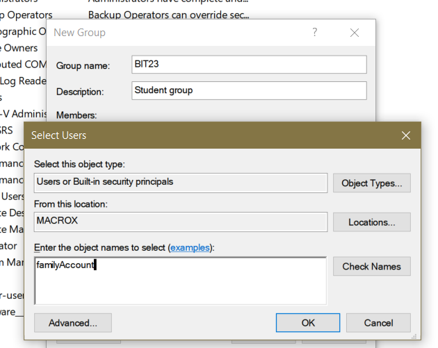 
    

5.	***Windows File & Folder Level Permissions: https://www.uwec.edu/kb/article/drives-establishing-windows-file-and-folder-level-permissions/***  
    1.	List standard permission types. 

    # These are the standard permission types 
    ● Full Control 
    ● Modify 
    ● Read & Execute 
    ●List Folder Contents 
    ● Read 
    ● Write


    2.	Create a new folder and name it as “firstname_lastname”. Grant only read and execute permission to a user account created above. **Take the screenshot that shows the permissions of this newly created folder.**
     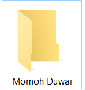

    3.	Create another folder and name it as “firstname_os”. Grant the following advanced folder level permissions: Traverse folder/ execute file, List folder /read data, Read attributes. **Take the screenshot that shows the permissions of this newly created folder.** 
    


6.	***Windows Updates & Recovery Options in Windows 11***
    1.	Windows Update: Check for Updates and if any updates are available, you should install updates. 
    2.	Configure Update Settings: Check your current update settings and update if needed how updates are delivered and configure other options according to your preferences.

    3.	Recovery Options: Create a system restore point and give it a name as your firstname_lastname_rpoint. **Take the screenshot of the newly created restore point.**

    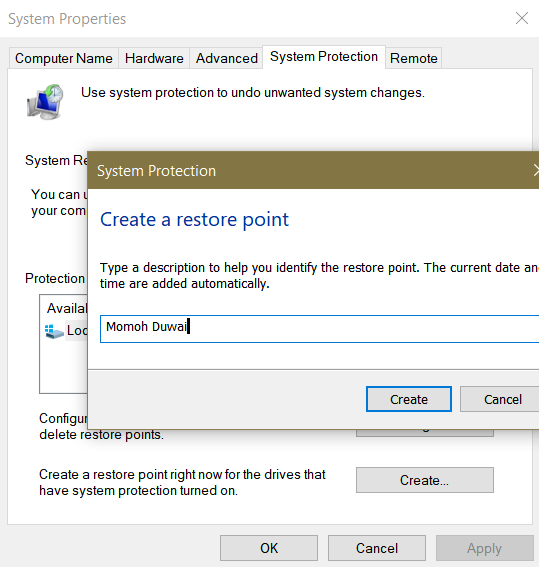
    
    4.	Reset your PC: Find how you can reset your PC however you are not required to reset your PC. 

    5.	Advance Startup Options: Read Microsoft Documentation and make a list of Advanced Startup options that are available in Windows 11. 

7.	***Local Storage*** 
    1.	View Disk Space Usage: Check your disk space usage and **take a screenshot showing the disk space usage.**

    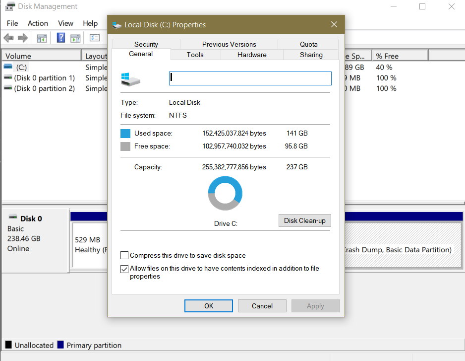

    2.	Disk Cleanup: Perform the disk cleanup task in your device and **take a screenshot showing the Disk Cleanup process**.
         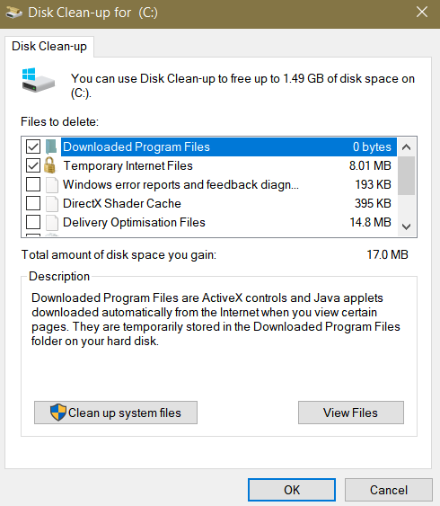

    3.	Defragment and Optimize Drives: Check one of your drive's fragmentation status. **Take a screenshot after you have analyzed one of your drives.**
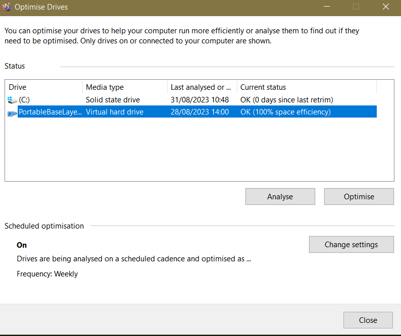

    4.	Learn how you can perform the following tasks. You are not required to execute them on your device. You don’t need to submit anything for the partition related tasks. 
        1.	Create a New Partition.
        2.	Extend the newly created partition.
        3.	Shrink a Partition.
        4.	Create a New Volume (Logical Drive).
        5.	Change the Drive letter.
        6.	Format a Partition or Volume
        7.	Delete a Partition
        8.	Convert Disk to GPT or MBR

8.	***Network Settings*** 
    1.	View your network properties and take a screenshot showing the network adapter details.
         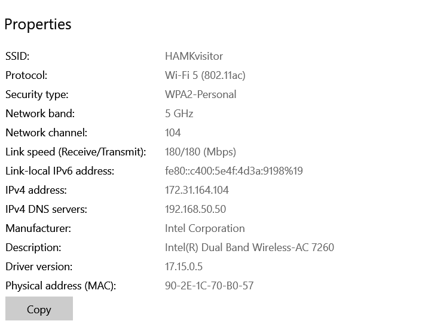

    2.	Change network adapter priority and **take a screenshot showing the changed adapter priority.**
    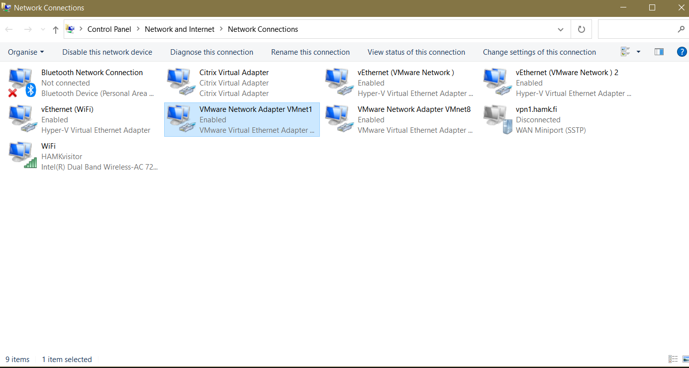

    3.	**Take a screenshot** that shows the preferred DNS server setting.
    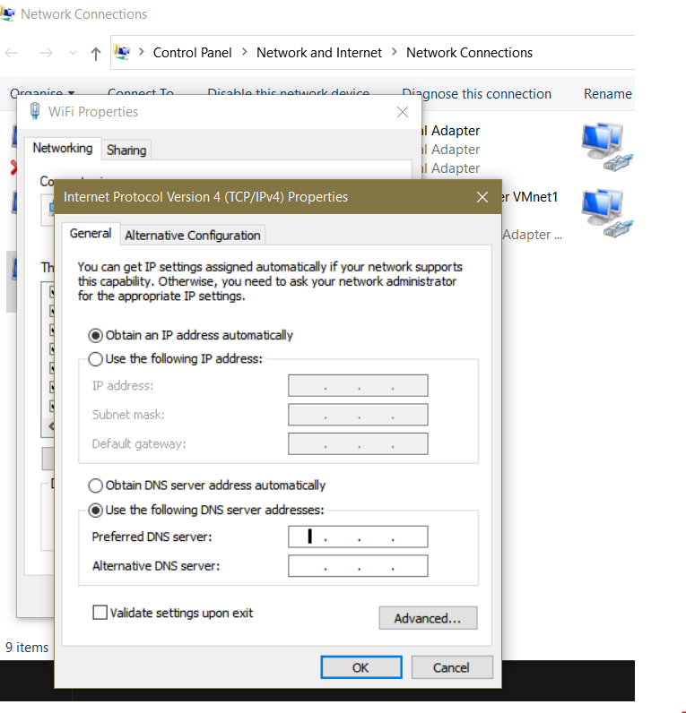

    4.	Change the network profile and **take a screenshot showing the changed network profile**.
    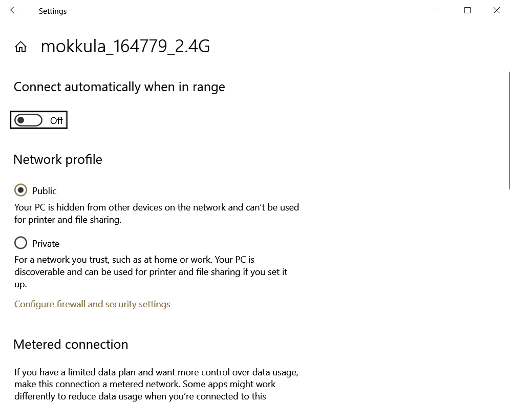


## Guidance and feedback
Guidance is available in class during the lecture.

## Evaluation
The learning portfolio is evaluated as Pass/Fail. You are required to complete all tasks successfully to get a Pass for the learning portfolio.

## Submission
You will complete this assignment and submit it in GitHub Classroom. You will then submit the link to the repository in Moodle(learn.hamk.fi). 
